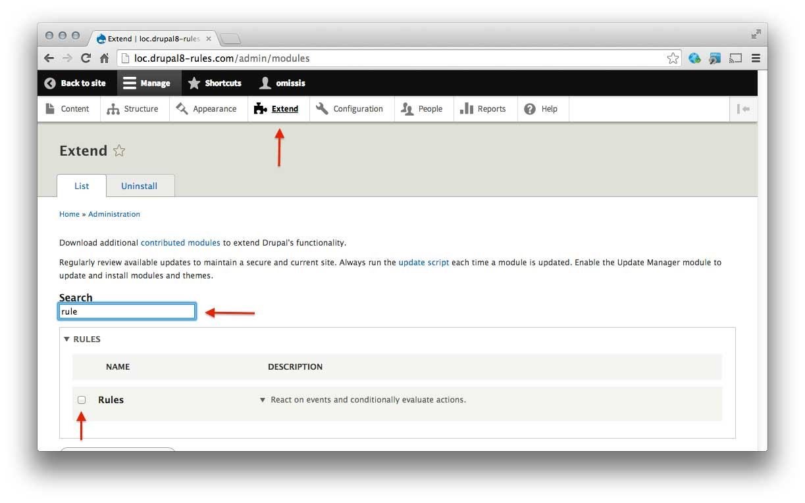

# Setting up the environment

### LAMP

The very first step for starting contributing to Rules is to setup a classic
"LAMP" environment: that's a bit out of the scope of this document, so please
take a look at [Drupal Installation Guide](https://drupal.org/documentation/install)
and especially at its [System requirements section](https://drupal.org/requirements).

### Drush

Installing the powerful Drupal Shell is not mandatory but it can definitely be helpful during development. For working with Drupal 8, you'll need a Drupal 8 compatible Drush version. The recommended way to install it is through composer, but be aware that the installation is going to be global and therefore will probably override your current one.

    composer global require drush/drush=8.*

Et voilà, the Drupal 8-compatible version of Drush will be quickly installed for you.

### Drupal 8

Once you've got your system ready to host Drupal 8, the next step is to go and
clone its repository in the directory where your web server will expect it to be
by using the following command, being careful to replace "MINOR_VERSION" and "DESTINATION_DIRECTORY" as needed:

    git clone --branch 8.MINOR_VERSION.x http://git.drupal.org/project/drupal.git DESTINATION_DIRECTORY

Please look at the [Drupal Git Instructions](https://drupal.org/project/drupal/git-instructions)
for more information about how to clone Drupal.

Once you finished cloning Drupal, set up a database for it and proceed with the
installation: after it's completed, the only thing's missing is the Rules
module.

### Rules

#### NOTE: you will need a working GitHub account for contributing to Rules.

In order to start working on Rules, you have to visit its
[module page on GitHub](https://github.com/fago/rules) and click the **fork**
button.

That will create a copy of the Rules repository on your GitHub account. At this
point you're ready to clone it in your working environment in a directory of your choice by using the following command (don't forget to replace YOUR_USER with
the name of your GitHub user):

    git clone git@github.com:YOUR_USER/rules.git

Once you did all of that, symlink the cloned rules directory under the Drupal's ``modules``
directory.

**NOTE: directly cloning Rules withing Drupal's ``modules`` directory is discouraged for development.**

The only thing left to do now is to head to the module page clicking on the
**Extend** button in the top menu and enable Rules.

