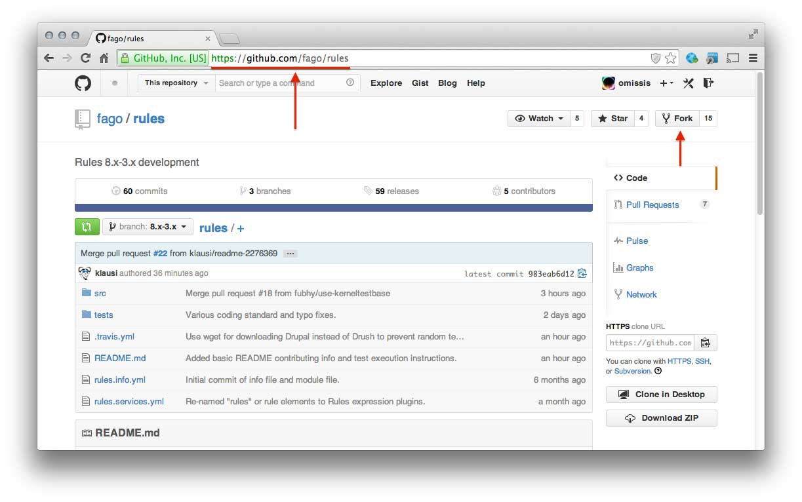

# Setting up the environment

### LAMP

The very first step for starting contributing to Rules is to setup a classic
"LAMP" environment: that's a bit out of the scope of this document, so please
take a look at [Drupal Installation Guide](https://drupal.org/documentation/install)
and especially at its [System requirements section](https://drupal.org/requirements).

### Drupal 8

Once you've got your system ready to host Drupal 8, the next step is to go and
clone its repository in the directory where your web server will expect it to be
by using the following command:

    git clone --branch 8.x http://git.drupal.org/project/drupal.git

Please look at the [Drupal Git Instructions](https://drupal.org/project/drupal/git-instructions)
for more information about how to clone Drupal.

Once you finished cloning Drupal, set up a database for it and proceed with the
installation: after it's completed, the only thing's missing is the Rules
module.

### Rules

#### NOTE: you will need a working GitHub account for contributing to Rules.

In order to start working on Rules, you have to visit its
[module page on GitHub](https://github.com/fago/rules) and click the **fork**
button.

That will create a copy of the Rules repository on your GitHub account. At this
point you're ready to clone it on your working environment under the ``modules``
directory by using the following command (don't forget to replace YOURUSER with
the name of your GitHub user):

    git clone git@github.com:YOURUSER/rules.git

The only thing left to do now is to head to the module page clicking on the
**Extend** button in the top menu and enable Rules.

